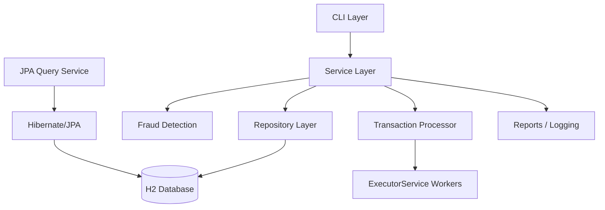

# System Architecture

The CLI handles interaction, services own business rules, repositories own JDBC access, and the database stores durable state. Fraud detection and concurrent processing are separate service concerns.
