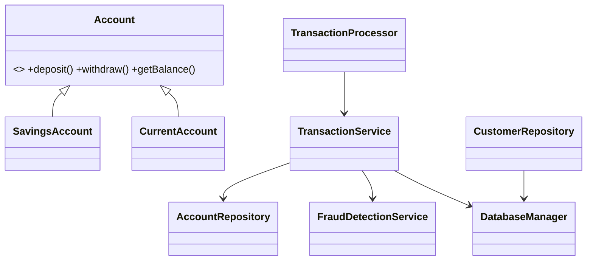

# Class Diagram

```mermaid
classDiagram
 class Account { <<abstract>> +deposit() +withdraw() +getBalance() }
 class SavingsAccount
 class CurrentAccount
 Account <|-- SavingsAccount
 Account <|-- CurrentAccount
 class TransactionService
 class FraudDetectionService
 class TransactionProcessor
 class DatabaseManager
 class CustomerRepository
 class AccountRepository
 TransactionService --> AccountRepository
 TransactionService --> FraudDetectionService
 TransactionService --> DatabaseManager
 TransactionProcessor --> TransactionService
 CustomerRepository --> DatabaseManager
```
