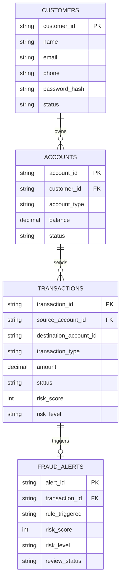

# ER Diagram

```mermaid
erDiagram
 CUSTOMERS ||--o{ ACCOUNTS : owns
 ACCOUNTS ||--o{ TRANSACTIONS : sends
 TRANSACTIONS ||--o| FRAUD_ALERTS : triggers
 CUSTOMERS { string customer_id PK string name string email string phone string password_hash string status }
 ACCOUNTS { string account_id PK string customer_id FK string account_type decimal balance string status }
 TRANSACTIONS { string transaction_id PK string source_account_id FK string destination_account_id string transaction_type decimal amount string status int risk_score string risk_level }
 FRAUD_ALERTS { string alert_id PK string transaction_id FK string rule_triggered int risk_score string risk_level string review_status }
```
