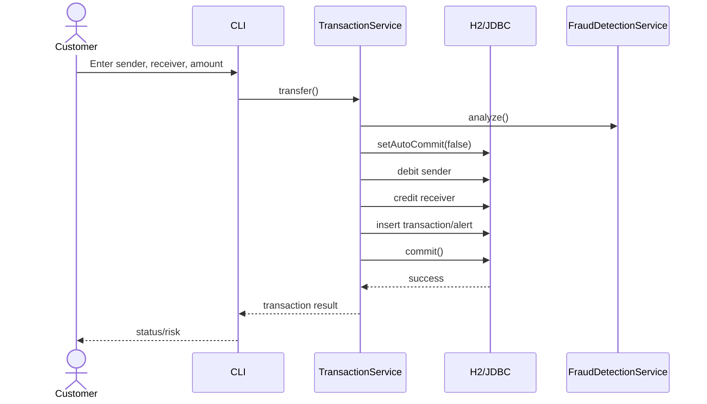

# Transfer Sequence

```mermaid
sequenceDiagram
 actor Customer
 participant CLI
 participant Service as TransactionService
 participant DB as H2/JDBC
 participant Fraud as FraudDetectionService
 Customer->>CLI: Enter sender, receiver, amount
 CLI->>Service: transfer()
 Service->>Fraud: analyze()
 Service->>DB: setAutoCommit(false)
 Service->>DB: debit sender
 Service->>DB: credit receiver
 Service->>DB: insert transaction/alert
 Service->>DB: commit()
 DB-->>Service: success
 Service-->>CLI: transaction result
 CLI-->>Customer: status/risk
```
