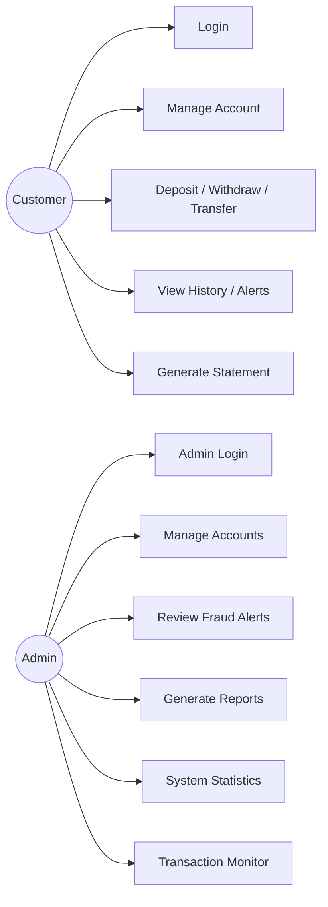

# Use Case Diagram

```mermaid
flowchart LR
 C((Customer)) --> L[Login]
 C --> A[Manage Account]
 C --> T[Deposit / Withdraw / Transfer]
 C --> H[View History / Alerts]
 C --> R[Generate Statement]
 D((Admin)) --> AL[Admin Login]
 D --> M[Manage Accounts]
 D --> F[Review Fraud Alerts]
 D --> RR[Generate Reports]
 D --> ST[System Statistics]
 D --> TM[Transaction Monitor]
```
