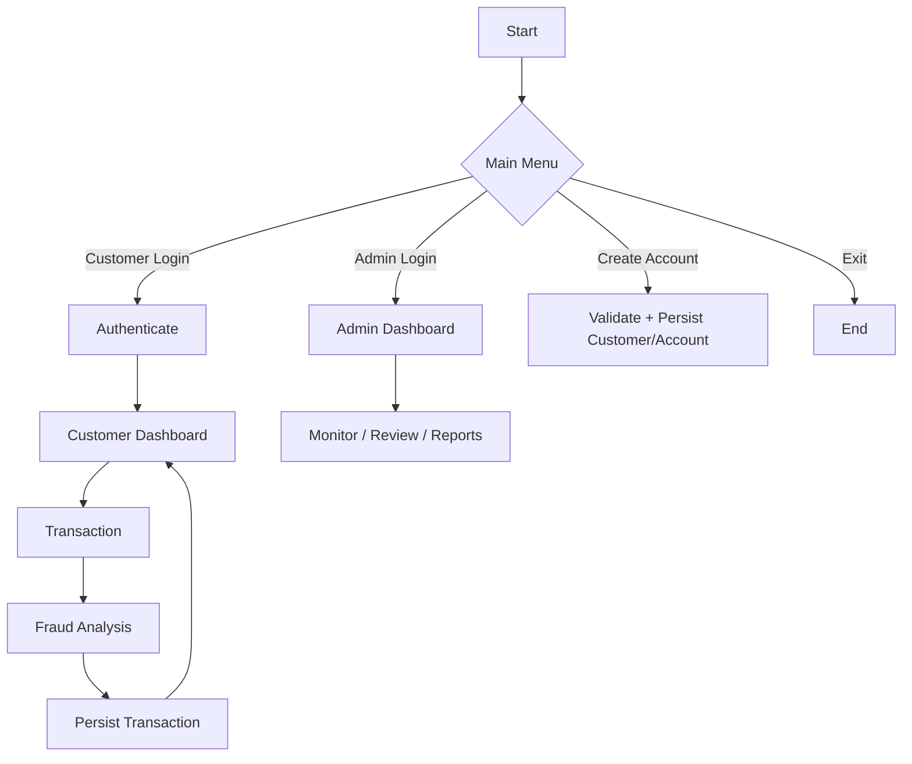

# Workflow

```mermaid
flowchart TD
 S[Start] --> M{Main Menu}
 M -->|Customer Login| C[Authenticate]
 C --> CD[Customer Dashboard]
 CD --> TX[Transaction]
 TX --> FD[Fraud Analysis]
 FD --> DB[Persist Transaction]
 DB --> CD
 M -->|Admin Login| AD[Admin Dashboard]
 AD --> MON[Monitor / Review / Reports]
 M -->|Create Account| CA[Validate + Persist Customer/Account]
 M -->|Exit| E[End]
```
